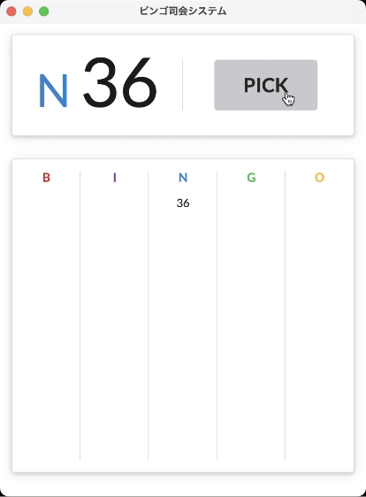

# ビンゴ司会システム

社会情報実践 制作物 No. 1

要件
[REQUIREMENTS.md](./documents/REQUIREMENTS.md)

## インストール方法

[Release](https://github.com/waiwai2525/bingo/releases)から最新のインストーラーをダウンロードしてください。

## 使い方

__PICK__ ボタンを押下するごとに新しい番号が表示されます。

最初から始めるときは再起動してください。
